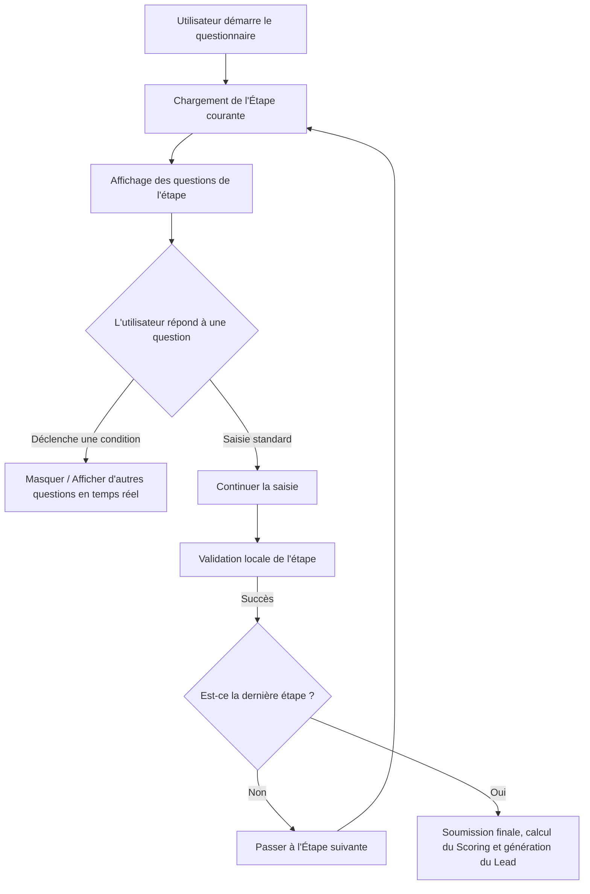

# Implémentation du Formulaire Dynamique Multi-étapes (Wizard)

Ce document décrit en détail l'architecture, la modélisation et l'implémentation du formulaire de comparaison dynamique pour KleverKat, inspiré de l'ergonomie de LesFurets.com, en utilisant **Laravel 13**, **PHP 8.4**, **Livewire v4**, **Flux UI** et **Tailwind CSS v4**.

---

## 1. Vision et Concept du Moteur de Formulaire

Pour gérer des questionnaires de comparaison complexes (comme l'assurance auto ou habitation) sans coder en dur chaque formulaire, KleverKat utilise un **Moteur de Formulaire Dynamique piloté par la Base de Données**. 

Les questionnaires sont divisés en **Étapes (Steps)**, chaque étape contenant des **Questions** ordonnées. La dynamicité repose sur des **Règles de Branchement Conditionnel** stockées au format JSON.



---

## 2. Modélisation de la Base de Données

Les questionnaires, questions et conditions sont modélisés dans les tables suivantes.

### 2.1. Migration : `create_questionnaires_table`
Un questionnaire est associé à une catégorie de produit (ex: Assurance Auto).

```php
Schema::create('questionnaires', function (Blueprint $table) {
    $table->id();
    $table->foreignId('category_id')->constrained('product_categories')->cascadeOnDelete();
    $table->string('title');
    $table->string('description')->nullable();
    $table->boolean('is_active')->default(true);
    $table->timestamps();
});
```

### 2.2. Migration : `create_questions_table`
Chaque question possède un type, des options (si applicable) et des métadonnées de validation et de conditionnalité.

```php
Schema::create('questions', function (Blueprint $table) {
    $table->id();
    $table->foreignId('questionnaire_id')->constrained()->cascadeOnDelete();
    $table->string('step_name'); // ex: 'vehicle', 'driver', 'history'
    $table->string('field_name'); // ex: 'license_date', 'has_second_driver'
    $table->string('label');
    $table->string('type'); // Enum: text, number, select, radio, checkbox, date
    $table->json('options')->nullable(); // Liste de valeurs possibles pour select/radio/checkbox
    $table->json('validation_rules')->nullable(); // ex: ['required', 'date', 'before:today']
    
    // Règle d'affichage conditionnel : ex {'depends_on': 'has_second_driver', 'equals': 'oui'}
    $table->json('display_conditions')->nullable(); 
    
    $table->integer('sort_order')->default(0);
    $table->boolean('is_active')->default(true);
    $table->timestamps();
});
```

---

## 3. Implémentation du Composant Livewire `CompareWizard`

Le composant `CompareWizard` gère l'état du formulaire, la navigation entre les étapes, la validation dynamique et l'interaction avec le `ScoringService`.

### 3.1. Structure du Composant : `app/Livewire/Public/CompareWizard.php`

```php
<?php

declare(strict_types=1);

namespace App\Livewire\Public;

use App\Models\Question;
use App\Models\Questionnaire;
use App\Models\ProductCategory;
use App\Services\ComparisonService;
use Livewire\Component;
use Livewire\Attributes\Url;
use Illuminate\Support\Collection;
use Illuminate\Support\Facades\Validator;
use Illuminate\View\View;

class CompareWizard extends Component
{
    public ProductCategory $category;
    public Questionnaire $questionnaire;
    
    // Contient les réponses de l'utilisateur sous la forme ['field_name' => 'valeur']
    public array $answers = [];
    
    // Étape actuelle du formulaire
    public string $currentStep = '';
    
    // Liste des étapes ordonnées détectées dans le questionnaire
    public array $steps = [];
    
    protected ComparisonService $comparisonService;

    public function boot(ComparisonService $comparisonService): void
    {
        $this->comparisonService = $comparisonService;
    }

    public function mount(ProductCategory $category): void
    {
        $this->category = $category;
        
        // Récupérer le questionnaire actif pour cette catégorie
        $this->questionnaire = Questionnaire::where('category_id', $category->id)
            ->where('is_active', true)
            ->with(['questions' => fn($q) => $q->where('is_active', true)->orderBy('sort_order')])
            ->firstOrFail();

        // Extraire la liste unique des étapes définies pour ce questionnaire
        $this->steps = $this->questionnaire->questions
            ->pluck('step_name')
            ->unique()
            ->values()
            ->toArray();

        if (count($this->steps) > 0) {
            $this->currentStep = $this->steps[0];
        }

        // Initialiser le tableau des réponses
        foreach ($this->questionnaire->questions as $question) {
            $this->answers[$question->field_name] = $question->type === 'checkbox' ? [] : null;
        }
    }

    /**
     * Obtenir les questions de l'étape courante qui satisfont les conditions d'affichage.
     */
    public function getActiveQuestionsProperty(): Collection
    {
        return $this->questionnaire->questions
            ->where('step_name', $this->currentStep)
            ->filter(fn(Question $question) => $this->shouldDisplay($question));
    }

    /**
     * Évalue si une question doit être affichée en fonction des réponses précédentes.
     */
    private function shouldDisplay(Question $question): bool
    {
        if (empty($question->display_conditions)) {
            return true;
        }

        $conditions = $question->display_conditions; // shape: ['depends_on' => string, 'equals' => mixed]
        $targetField = $conditions['depends_on'] ?? null;
        $expectedValue = $conditions['equals'] ?? null;

        if (!$targetField) {
            return true;
        }

        // Vérifier si le champ parent a la valeur attendue
        return ($this->answers[$targetField] ?? null) === $expectedValue;
    }

    /**
     * Valide l'étape en cours et passe à la suivante.
     */
    public function nextStep(): void
    {
        $this->validateCurrentStep();

        $currentIndex = array_search($this->currentStep, $this->steps);
        
        if ($currentIndex !== false && $currentIndex < count($this->steps) - 1) {
            $this->currentStep = $this->steps[$currentIndex + 1];
            $this->dispatch('step-changed', step: $this->currentStep);
        } else {
            $this->submit();
        }
    }

    /**
     * Retourner à l'étape précédente.
     */
    public function previousStep(): void
    {
        $currentIndex = array_search($this->currentStep, $this->steps);
        
        if ($currentIndex !== false && $currentIndex > 0) {
            $this->currentStep = $this->steps[$currentIndex - 1];
            $this->dispatch('step-changed', step: $this->currentStep);
        }
    }

    /**
     * Valide dynamiquement les champs de l'étape active.
     */
    protected function validateCurrentStep(): void
    {
        $rules = [];
        $attributes = [];

        foreach ($this->activeQuestions as $question) {
            if (!empty($question->validation_rules)) {
                $rules["answers.{$question->field_name}"] = $question->validation_rules;
                $attributes["answers.{$question->field_name}"] = $question->label;
            }
        }

        if (!empty($rules)) {
            $this->validate($rules, [], $attributes);
        }
    }

    /**
     * Soumission finale du questionnaire.
     */
    public function submit(): void
    {
        // 1. Valider la dernière étape
        $this->validateCurrentStep();

        // 2. Traiter les réponses via le ComparisonService
        $result = $this->comparisonService->processResponses($this->answers, $this->category);

        // 3. Créer un Lead en attente (Fortify gère l'authentification si requise à cette étape)
        $lead = $this->comparisonService->createLead($this->answers, $result);

        // 4. Rediriger vers la page de résultats
        $this->redirect(route('results.show', ['lead' => $lead->id]), navigate: true);
    }

    public function render(): View
    {
        return view('livewire.public.compare-wizard', [
            'questions' => $this->activeQuestions,
            'progress' => $this->calculateProgress(),
        ]);
    }

    private function calculateProgress(): int
    {
        $currentIndex = array_search($this->currentStep, $this->steps);
        if ($currentIndex === false || count($this->steps) === 0) {
            return 0;
        }
        return (int) (($currentIndex / count($this->steps)) * 100);
    }
}
```

---

## 4. Rendu Frontend avec Flux UI et Tailwind CSS v4

L'intégration de **Flux UI** permet de construire des formulaires avec une esthétique premium et responsive, des micro-animations naturelles de transitions de pas, et des contrôles accessibles de manière native.

### 4.1. Fichier de Vue principal : `resources/views/livewire/public/compare-wizard.blade.php`

```html
<div class="max-w-3xl mx-auto py-8 px-4 sm:px-6 lg:px-8">
    
    <!-- Barre de Progression premium -->
    <div class="mb-8">
        <div class="flex justify-between items-center mb-2">
            <span class="text-sm font-semibold text-zinc-500 dark:text-zinc-400">
                Étape {{ array_search($currentStep, $steps) + 1 }} sur {{ count($steps) }}
            </span>
            <span class="text-sm font-bold text-sky-600 dark:text-sky-400">
                {{ $progress }}% complété
            </span>
        </div>
        <div class="w-full bg-zinc-200 dark:bg-zinc-800 rounded-full h-2 overflow-hidden">
            <div class="bg-gradient-to-r from-sky-500 to-indigo-600 h-full rounded-full transition-all duration-500 ease-out" 
                 style="width: {{ $progress }}%">
            </div>
        </div>
    </div>

    <!-- Conteneur principal du Formulaire -->
    <flux:card class="p-6 md:p-8 shadow-xl border border-zinc-100 dark:border-zinc-800 backdrop-blur-md bg-white/90 dark:bg-zinc-900/90">
        
        <div class="mb-6">
            <flux:heading size="xl" level="2" class="bg-gradient-to-r from-zinc-900 to-zinc-600 dark:from-white dark:to-zinc-400 bg-clip-text text-transparent font-extrabold">
                {{ $questionnaire->title }}
            </flux:heading>
            <flux:subheading class="mt-2 text-zinc-500">
                Veuillez répondre aux questions ci-dessous pour trouver les meilleures offres.
            </flux:subheading>
        </div>

        <form wire:submit.prevent="nextStep" class="space-y-6">
            
            <!-- Questions Dynamiques actives -->
            <div class="space-y-6 transition-all duration-300 ease-in-out">
                @foreach ($questions as $question)
                    <div wire:key="question-{{ $question->id }}" class="transition-opacity duration-300">
                        
                        @if ($question->type === 'text')
                            <flux:input 
                                label="{{ $question->label }}" 
                                wire:model="answers.{{ $question->field_name }}" 
                                type="text"
                                placeholder="..."
                            />
                            
                        @elseif ($question->type === 'number')
                            <flux:input 
                                label="{{ $question->label }}" 
                                wire:model="answers.{{ $question->field_name }}" 
                                type="number"
                                placeholder="0"
                            />
                            
                        @elseif ($question->type === 'date')
                            <flux:input 
                                label="{{ $question->label }}" 
                                wire:model="answers.{{ $question->field_name }}" 
                                type="date"
                            />
                            
                        @elseif ($question->type === 'select')
                            <flux:select label="{{ $question->label }}" wire:model="answers.{{ $question->field_name }}">
                                <option value="">Sélectionnez une option...</option>
                                @foreach ($question->options as $value => $label)
                                    <option value="{{ $value }}">{{ $label }}</option>
                                @endforeach
                            </flux:select>
                            
                        @elseif ($question->type === 'radio')
                            <div class="space-y-2">
                                <flux:label>{{ $question->label }}</flux:label>
                                <flux:radio.group wire:model="answers.{{ $question->field_name }}" variant="cards" class="grid grid-cols-1 sm:grid-cols-2 gap-3">
                                    @foreach ($question->options as $value => $label)
                                        <flux:radio value="{{ $value }}" label="{{ $label }}" />
                                    @endforeach
                                </flux:radio.group>
                            </div>

                        @elseif ($question->type === 'checkbox')
                            <div class="space-y-2">
                                <flux:label>{{ $question->label }}</flux:label>
                                <div class="grid grid-cols-1 sm:grid-cols-2 gap-3">
                                    @foreach ($question->options as $value => $label)
                                        <flux:checkbox 
                                            wire:model="answers.{{ $question->field_name }}" 
                                            value="{{ $value }}" 
                                            label="{{ $label }}" 
                                        />
                                    @endforeach
                                </div>
                            </div>
                        @endif

                        <!-- Gestion des erreurs dynamique -->
                        @error("answers.{$question->field_name}")
                            <span class="text-xs text-rose-500 font-medium mt-1 block">
                                {{ $message }}
                            </span>
                        @enderror
                    </div>
                @endforeach
            </div>

            <!-- Actions de navigation -->
            <div class="flex justify-between items-center pt-6 border-t border-zinc-100 dark:border-zinc-800 mt-8">
                @if (array_search($currentStep, $steps) > 0)
                    <flux:button 
                        type="button" 
                        wire:click="previousStep" 
                        variant="ghost" 
                        icon="arrow-left"
                    >
                        Précédent
                    </flux:button>
                @else
                    <div></div>
                @endif

                <flux:button 
                    type="submit" 
                    variant="primary" 
                    class="bg-gradient-to-r from-sky-500 to-indigo-600 hover:from-sky-600 hover:to-indigo-700 text-white font-semibold shadow-md shadow-sky-200 dark:shadow-none"
                    wire:loading.attr="disabled"
                >
                    <span wire:loading.remove>
                        {{ array_search($currentStep, $steps) === count($steps) - 1 ? 'Comparer les offres' : 'Suivant' }}
                    </span>
                    <span wire:loading class="flex items-center gap-2">
                        <flux:spinner size="xs" />
                        Chargement...
                    </span>
                </flux:button>
            </div>

        </form>
    </flux:card>
</div>
```

---

## 5. Persistence et Reprise (UX Premium)

Pour éviter que l'utilisateur ne perde sa saisie en cas de rafraîchissement involontaire ou de micro-coupure réseau :
1. **Session-based Persistence :** À chaque passage d'étape (`nextStep`), sauvegardez l'état actuel de `$answers` dans la session de l'utilisateur :
   ```php
   session()->put("compare_wizard_{$this->category->id}", $this->answers);
   ```
2. **Initialisation lors du `mount` :** Lors du chargement, vérifiez la présence d'une session active pour pré-remplir le formulaire :
   ```php
   $savedAnswers = session()->get("compare_wizard_{$category->id}");
   if ($savedAnswers) {
       $this->answers = array_merge($this->answers, $savedAnswers);
   }
   ```
3. **Nettoyage :** Après soumission finale et génération réussie du Lead, supprimez la clé de session :
   ```php
   session()->forget("compare_wizard_{$this->category->id}");
   ```

---

## 6. Stratégie de Validation & Sécurité

* **Sanitisation :** Avant de passer au traitement par le `ScoringService`, toutes les entrées utilisateur doivent être purifiées.
* **Validation stricte côté serveur :** La validation dynamique au niveau de chaque étape (`validateCurrentStep`) s'assure qu'un utilisateur ne peut pas contourner les règles en manipulant le DOM ou les requêtes Livewire (protection contre l'injection de paramètres).

---

## 7. Tests d'Intégration et Fonctionnels (Pest PHP)

La robustesse du formulaire dynamique et de sa logique de branchement conditionnel doit être couverte par des tests automatisés robustes.

Voici un exemple de test fonctionnel Pest simulant le parcours utilisateur complet :

`tests/Feature/ComparisonWizardTest.php`
```php
<?php

use App\Livewire\Public\CompareWizard;
use App\Models\ProductCategory;
use App\Models\Question;
use App\Models\Questionnaire;
use Livewire\Livewire;

beforeEach(function () {
    // Créer une catégorie de produit pour le test
    $this->category = ProductCategory::factory()->create(['name' => 'Auto', 'slug' => 'auto']);
    
    // Créer un questionnaire associé
    $this->questionnaire = Questionnaire::factory()->create([
        'category_id' => $this->category->id,
        'title' => 'Comparateur Assurance Auto',
        'is_active' => true,
    ]);

    // Étape 1 : Véhicule
    $this->q1 = Question::factory()->create([
        'questionnaire_id' => $this->questionnaire->id,
        'step_name' => 'vehicule',
        'field_name' => 'has_vehicle',
        'type' => 'radio',
        'options' => ['oui' => 'Oui', 'non' => 'Non'],
        'validation_rules' => ['required'],
        'sort_order' => 1,
    ]);

    // Question conditionnelle de l'Étape 1 (affichée uniquement si has_vehicle === 'oui')
    $this->q2 = Question::factory()->create([
        'questionnaire_id' => $this->questionnaire->id,
        'step_name' => 'vehicule',
        'field_name' => 'vehicle_value',
        'type' => 'number',
        'validation_rules' => ['required_if:answers.has_vehicle,oui', 'numeric'],
        'display_conditions' => ['depends_on' => 'has_vehicle', 'equals' => 'oui'],
        'sort_order' => 2,
    ]);

    // Étape 2 : Conducteur
    $this->q3 = Question::factory()->create([
        'questionnaire_id' => $this->questionnaire->id,
        'step_name' => 'conducteur',
        'field_name' => 'driver_age',
        'type' => 'number',
        'validation_rules' => ['required', 'integer', 'min:18'],
        'sort_order' => 3,
    ]);
});

it('can load the comparison wizard with active steps', function () {
    Livewire::test(CompareWizard::class, ['category' => $this->category])
        ->assertStatus(200)
        ->assertSet('currentStep', 'vehicule')
        ->assertSee('Comparateur Assurance Auto');
});

it('validates required fields on step submission', function () {
    Livewire::test(CompareWizard::class, ['category' => $this->category])
        ->call('nextStep')
        ->assertHasErrors(['answers.has_vehicle']);
});

it('evaluates branching conditional questions correctly', function () {
    $wizard = Livewire::test(CompareWizard::class, ['category' => $this->category])
        ->assertDontSeeHtml('name="answers.vehicle_value"'); // Ne pas afficher la question conditionnelle au départ

    // Définir la réponse déclencheuse sur 'oui'
    $wizard->set('answers.has_vehicle', 'oui')
        ->assertSeeHtml('answers.vehicle_value'); // La question conditionnelle doit apparaître dans le DOM dynamique
});

it('navigates through steps and submits the dynamic form successfully', function () {
    Livewire::test(CompareWizard::class, ['category' => $this->category])
        // Remplir l'Étape 1
        ->set('answers.has_vehicle', 'oui')
        ->set('answers.vehicle_value', 15000)
        ->call('nextStep')
        ->assertHasNoErrors()
        ->assertSet('currentStep', 'conducteur') // Changement d'étape validé

        // Remplir l'Étape 2 (Dernière étape)
        ->set('answers.driver_age', 32)
        ->call('nextStep') // Soumission finale
        ->assertHasNoErrors()
        ->assertRedirect(); // Devrait rediriger vers /resultats/{lead}
});
