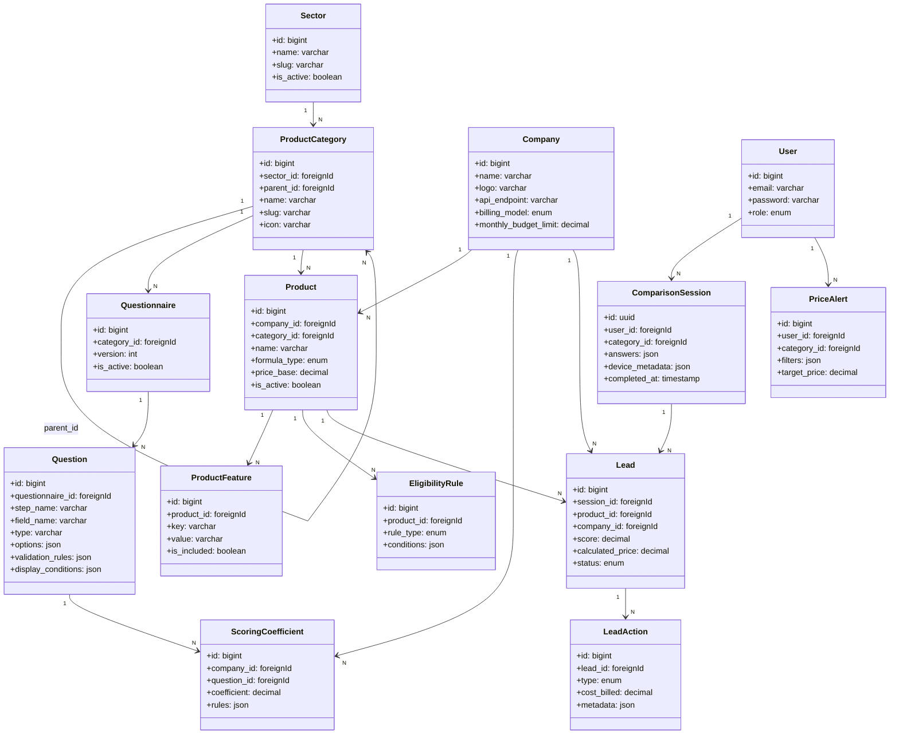

# Modélisation Complète inspirée de LesFurets.com

Ce document propose une modélisation de données globale et exhaustive pour le projet **KleverKat**, directement calquée sur l'architecture de données de **LesFurets.com**. Il s'agit d'une conception de niveau production conçue pour gérer le multi-produit (assurance, crédit, énergie), la personnalisation, l'éligibilité en temps réel, la facturation des partenaires et le suivi multi-device des utilisateurs.

---

## 1. Diagramme Entité-Relation Global (Mermaid)

Voici la cartographie relationnelle du système complet. Chaque bloc fonctionnel est détaillé dans les sections suivantes.



---

## 2. Bloc 1 : Taxonomie, Partenaires et Catalogue Produits

Pour égaler la diversité de LesFurets.com, le catalogue doit gérer plusieurs secteurs d'activité, des structures de catégories parent-enfant, et une modélisation flexible des garanties/caractéristiques des offres.

### 2.1. Les Secteurs et Catégories
LesFurets compare des assurances (auto, moto, habitation, santé), mais aussi de l'énergie (électricité, gaz) et des banques (crédits, comptes).
* **`sectors`** : Définit les grands univers d'activité.
* **`product_categories`** : Modélise les produits spécifiques avec auto-référencement pour gérer les sous-catégories (ex: *Assurance -> Auto -> Jeune Conducteur*).

```sql
CREATE TABLE sectors (
    id bigint PRIMARY KEY AUTO_INCREMENT,
    name varchar(255) NOT NULL, -- ex: "Assurance", "Énergie", "Banque"
    slug varchar(255) NOT NULL UNIQUE,
    is_active boolean DEFAULT true,
    created_at timestamp,
    updated_at timestamp
);

CREATE TABLE product_categories (
    id bigint PRIMARY KEY AUTO_INCREMENT,
    sector_id bigint NOT NULL REFERENCES sectors(id),
    parent_id bigint NULL REFERENCES product_categories(id) ON DELETE SET NULL,
    name varchar(255) NOT NULL, -- ex: "Assurance Auto", "Assurance Habitation"
    slug varchar(255) NOT NULL UNIQUE,
    icon varchar(100) NULL,
    is_active boolean DEFAULT true,
    created_at timestamp,
    updated_at timestamp
);
```

### 2.2. Les Partenaires (Companies)
Les assureurs ou banques partenaires. Pour gérer la volumétrie et la facturation, cette table intègre des informations d'intégration d'API et des budgets d'acquisition.
* **`billing_model`** : LesFurets facture principalement au CPL (Cost Per Lead - clic vers le site ou demande de devis) ou au CPA (Cost Per Acquisition - contrat signé).
* **`monthly_budget_limit`** : Le budget mensuel max du partenaire. Si cette limite est atteinte, ses offres n'apparaissent plus dans les classements pour éviter la sur-facturation.

```sql
CREATE TABLE companies (
    id bigint PRIMARY KEY AUTO_INCREMENT,
    user_id bigint NULL REFERENCES users(id) ON DELETE SET NULL, -- Compte d'accès partenaire
    name varchar(255) NOT NULL, -- ex: "Allianz", "Direct Assurance"
    slug varchar(255) NOT NULL UNIQUE,
    logo varchar(255) NULL,
    billing_model varchar(50) NOT NULL, -- Enum: 'cpl' (lead), 'cpa' (acquisition)
    cpl_rate decimal(10,2) DEFAULT 0.00, -- Coût fixe facturé par lead envoyé
    monthly_budget_limit decimal(12,2) NULL, -- Capping budgétaire mensuel
    api_endpoint varchar(255) NULL, -- Endpoint API partenaire si intégration directe
    api_token varchar(255) NULL,
    is_active boolean DEFAULT true,
    created_at timestamp,
    updated_at timestamp
);
```

### 2.3. Les Produits et Caractéristiques (Garanties)
Chaque produit a une formule (Tiers, Tous Risques, Intermédiaire) et une liste dynamique de caractéristiques.
* **`product_features`** : Stocke toutes les caractéristiques ou garanties (ex: *Bris de glace*, *Assistance 0km*, *Franchise vol*). La valeur peut être booléenne (incluse ou non) ou textuelle (montant de franchise).

```sql
CREATE TABLE products (
    id bigint PRIMARY KEY AUTO_INCREMENT,
    company_id bigint NOT NULL REFERENCES companies(id) ON DELETE CASCADE,
    category_id bigint NOT NULL REFERENCES product_categories(id) ON DELETE CASCADE,
    name varchar(255) NOT NULL, -- ex: "Allianz Auto Confort"
    slug varchar(255) NOT NULL UNIQUE,
    formula_type varchar(100) NULL, -- ex: "Tous Risques", "Tiers Simple"
    price_base decimal(10,2) NOT NULL, -- Prix de base servant de point de départ pour le calcul
    is_active boolean DEFAULT true,
    created_at timestamp,
    updated_at timestamp
);

CREATE TABLE product_features (
    id bigint PRIMARY KEY AUTO_INCREMENT,
    product_id bigint NOT NULL REFERENCES products(id) ON DELETE CASCADE,
    key_name varchar(255) NOT NULL, -- ex: "assistance_0km", "glass_breakage_deductible"
    label varchar(255) NOT NULL, -- ex: "Assistance 0 km", "Franchise Bris de glace"
    value varchar(255) NOT NULL, -- ex: "Oui", "150 €", "Option"
    is_included boolean DEFAULT true, -- Permet d'afficher un badge oui/non visuel
    sort_order integer DEFAULT 0,
    created_at timestamp,
    updated_at timestamp
);
```

---

## 3. Bloc 2 : Moteur de Questionnaires Dynamiques

LesFurets.com doit pouvoir faire évoluer ses questions selon la législation (ex: nouvelle réglementation sur le bonus/malus) ou le type de produit, sans redéployer de code.

> [!NOTE]
> Les questionnaires sont historisés (`version`). Si un utilisateur revient 6 mois plus tard consulter ses anciennes réponses, le système doit savoir quel questionnaire exact il a rempli pour ne pas casser l'affichage.

```sql
CREATE TABLE questionnaires (
    id bigint PRIMARY KEY AUTO_INCREMENT,
    category_id bigint NOT NULL REFERENCES product_categories(id) ON DELETE CASCADE,
    title varchar(255) NOT NULL,
    version integer DEFAULT 1,
    is_active boolean DEFAULT true,
    created_at timestamp,
    updated_at timestamp
);

CREATE TABLE questions (
    id bigint PRIMARY KEY AUTO_INCREMENT,
    questionnaire_id bigint NOT NULL REFERENCES questionnaires(id) ON DELETE CASCADE,
    step_name varchar(100) NOT NULL, -- ex: "vehicule", "conducteur", "profil"
    field_name varchar(100) NOT NULL, -- ex: "has_garage", "driver_license_date"
    label text NOT NULL, -- ex: "Votre véhicule dort-il dans un garage clos ?"
    type varchar(50) NOT NULL, -- Enum: 'text', 'number', 'select', 'radio', 'checkbox', 'date'
    options json NULL, -- Valeurs possibles: {"garage": "Garage clos", "street": "Dans la rue"}
    validation_rules json NULL, -- ex: ["required", "string"] ou ["required_if:answers.has_license,oui"]
    display_conditions json NULL, -- ex: {"depends_on": "has_license", "equals": "oui"}
    sort_order integer DEFAULT 0,
    is_active boolean DEFAULT true,
    created_at timestamp,
    updated_at timestamp
);
```

---

## 4. Bloc 3 : Moteur d'Éligibilité, de Surcharges et de Scoring

Le cœur de valeur d'un comparateur comme LesFurets.com est sa capacité à filtrer les offres inéligibles et à calculer le prix final ou le score d'adéquation en temps réel.

### 4.1. Moteur d'Éligibilité (`eligibility_rules`)
Avant même de calculer un score ou un tarif personnalisé, le moteur doit exclure les profils que l'assureur refuse d'assurer.
* **Exemple d'exclusion :** Un assureur refuse d'assurer les conducteurs de moins de 21 ans pour une formule sportive.
* **`conditions` (JSON) :** Contient la règle structurelle d'éligibilité : `{"field": "driver_age", "operator": "<", "value": 21}`.

```sql
CREATE TABLE eligibility_rules (
    id bigint PRIMARY KEY AUTO_INCREMENT,
    product_id bigint NOT NULL REFERENCES products(id) ON DELETE CASCADE,
    rule_type varchar(50) NOT NULL DEFAULT 'allow', -- Enum: 'allow' (autoriser uniquement si), 'deny' (exclure si)
    conditions json NOT NULL, -- La structure logique de validation du critère
    error_message varchar(255) NULL, -- Message affiché en interne pour expliquer l'exclusion
    created_at timestamp,
    updated_at timestamp
);
```

### 4.2. Moteur de Coefficients et Surcharges (`scoring_coefficients`)
Le tarif de base du produit (`price_base`) est impacté par les réponses de l'utilisateur (le profil de risque).
* **Exemple de surcharge :** Si l'utilisateur répond qu'il habite à Paris (`answers.city = 'paris'`), le tarif de l'assurance augmente de 15% (coefficient `1.15`). Si le véhicule dort dehors, coefficient `1.10`.
* Le **Score Final** d'affinité ou le prix ajusté est calculé en croisant tous les coefficients applicables.

```sql
CREATE TABLE scoring_coefficients (
    id bigint PRIMARY KEY AUTO_INCREMENT,
    company_id bigint NOT NULL REFERENCES companies(id) ON DELETE CASCADE,
    question_id bigint NOT NULL REFERENCES questions(id) ON DELETE CASCADE,
    coefficient decimal(5,2) DEFAULT 1.00, -- ex: 1.20 (surcharge) ou 0.90 (bonus)
    logic json NOT NULL, -- ex: {"if_value": "paris"} ou {"range": {"min": 18, "max": 25}}
    UNIQUE(company_id, question_id, logic), -- Index d'unicité pour éviter les doublons de règles
    created_at timestamp,
    updated_at timestamp
);
```

---

## 5. Bloc 4 : Profils Utilisateurs, Sessions et Alertes Tarifs

Pour fidéliser les clients comme le fait LesFurets, l'application doit permettre aux utilisateurs de sauvegarder leurs simulations, de s'y reconnecter depuis n'importe quel appareil, et de programmer des alertes de prix.

### 5.1. Session de Comparaison (`comparison_sessions`)
Un utilisateur peut lancer une comparaison sans avoir de compte créé. L'état est lié à un `uuid` et stocké en base.
* **`answers` (JSON) :** Stocke l'intégralité des réponses brutes fournies par l'utilisateur.
* **Suivi Cross-Device :** Si un utilisateur non-connecté finit par créer un compte à la fin du formulaire, la session est rattachée à son `user_id`.

```sql
CREATE TABLE comparison_sessions (
    id uuid PRIMARY KEY, -- Identifiant unique de simulation (évite les IDs séquentiels prévisibles)
    user_id bigint NULL REFERENCES users(id) ON DELETE SET NULL, -- Rattaché si l'utilisateur est connecté
    category_id bigint NOT NULL REFERENCES product_categories(id) ON DELETE CASCADE,
    answers json NOT NULL, -- Stockage brut de toutes les réponses du formulaire
    device_metadata json NULL, -- OS, browser, IP, localisation estimée
    completed_at timestamp NULL, -- Date de finalisation du questionnaire
    created_at timestamp,
    updated_at timestamp
);
```

### 5.2. Alertes Tarifs (`price_alerts`)
LesFurets propose aux utilisateurs d'être alertés dès qu'un assureur baisse ses tarifs pour leur profil.
* **`filters` (JSON) :** Stocke les critères de l'alerte. Si un nouveau produit ou un nouveau tarif correspond aux filtres, un email automatique est envoyé.

```sql
CREATE TABLE price_alerts (
    id bigint PRIMARY KEY AUTO_INCREMENT,
    user_id bigint NOT NULL REFERENCES users(id) ON DELETE CASCADE,
    category_id bigint NOT NULL REFERENCES product_categories(id) ON DELETE CASCADE,
    filters json NULL, -- Critères spécifiques de filtres (ex: "uniquement Tous Risques")
    target_price decimal(10,2) NULL, -- Déclencher uniquement si le prix descend sous cette valeur
    is_active boolean DEFAULT true,
    created_at timestamp,
    updated_at timestamp
);
```

---

## 6. Bloc 5 : Leads, Actions (Clics) et Facturation Partenaire

C'est le module de monétisation du projet. Un comparateur se rémunère en vendant les leads qualifiés aux assureurs.

> [!IMPORTANT]
> Un **Lead** correspond à la mise en relation entre un utilisateur ayant effectué une simulation et une offre d'un partenaire. Un lead génère des **Actions** (clic vers le site partenaire, appel téléphonique initié, demande de rappel).

```sql
CREATE TABLE leads (
    id bigint PRIMARY KEY AUTO_INCREMENT,
    session_id uuid NOT NULL REFERENCES comparison_sessions(id) ON DELETE CASCADE,
    product_id bigint NOT NULL REFERENCES products(id) ON DELETE CASCADE,
    company_id bigint NOT NULL REFERENCES companies(id) ON DELETE CASCADE,
    score decimal(5,2) NULL, -- Score d'affinité calculé (de 0.00 à 100.00)
    calculated_price decimal(10,2) NOT NULL, -- Le tarif personnalisé calculé pour ce profil
    status varchar(50) DEFAULT 'new', -- Enum: 'new', 'transmitted', 'converted', 'rejected'
    transmitted_at timestamp NULL, -- Date d'envoi du lead via l'API du partenaire
    created_at timestamp,
    updated_at timestamp
);

CREATE TABLE lead_actions (
    id bigint PRIMARY KEY AUTO_INCREMENT,
    lead_id bigint NOT NULL REFERENCES leads(id) ON DELETE CASCADE,
    type varchar(50) NOT NULL, -- Enum: 'click_to_partner', 'callback_requested', 'document_downloaded'
    cost_billed decimal(10,2) DEFAULT 0.00, -- Le coût facturé au partenaire pour cette action précise
    metadata json NULL, -- Informations supplémentaires sur le clic (campagne UTM, etc.)
    created_at timestamp,
    updated_at timestamp
);
```

---

## 7. Avantages et Alignement avec la Stack du Projet

Cette modélisation s'accorde parfaitement avec **Laravel 13** et **PHP 8.4** :

1. **Cast JSON natif d'Eloquent :** Les colonnes `answers`, `options`, `validation_rules`, `display_conditions` et `logic` se mappent directement sur des tableaux PHP typés en utilisant les casts d'Eloquent (`AsArrayObject` ou `AsCollection`).
2. **UUIDs pour la confidentialité :** Les sessions de comparaison utilisant des UUIDs garantissent qu'un utilisateur ne peut pas deviner ou accéder aux simulations d'autres utilisateurs en modifiant simplement les IDs dans l'URL.
3. **Mise en cache performante :** La structure des questionnaires et des règles de scoring étant relativement statique, elle peut être mise en cache de manière agressive dans Redis/Memcached et invalidée uniquement via des observateurs Eloquent (Eloquent Events) lors d'une mise à jour dans l'espace administrateur (Filament).
4. **Scabilité avec SQLite/MySQL/PostgreSQL :** Les types de données choisis (`json`, `decimal` pour les montants financiers, clés étrangères indexées) garantissent des requêtes de jointure très rapides même sur des millions de lignes de leads.
