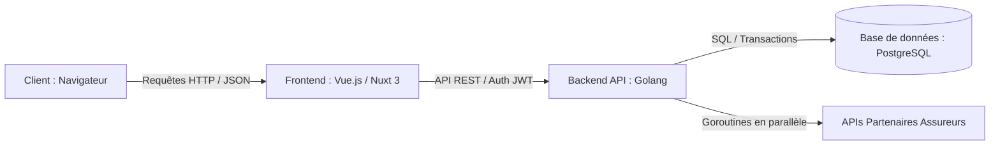

C'est un excellent choix d'architecture ! L'alliance de Golang pour le backend et de Vue.js pour le frontend
est           
particulièrement puissante pour ce type de projet.

Le principal point fort de ce choix est la performance pure et la concurrence : Go est le langage idéal pour interroger
50
APIs d'assureurs partenaires en parallèle via des goroutines en quelques millisecondes, tandis que Vue 3 offre
une         
réactivité exceptionnelle pour l'expérience du questionnaire.

Voici comment structurer et développer ce projet avec cette nouvelle
stack.                                                
──────

## 1. L'Architecture Globale (Découplée)

Le projet sera divisé en deux entités indépendantes qui communiquent via une API REST JSON sécurisée.



──────

## 2. Le Backend : Golang

Go brille par sa vitesse d'exécution, sa faible empreinte mémoire et sa gestion native de la concurrence.

### 2.1. La Stack Go recommandée

• Framework Web / Routeur : Fiber (ultra-rapide, syntaxe proche d'Express) ou Gin (très populaire et
robuste).             
• Accès Base de Données (ORM) : Ent (un ORM d'entités/graphes moderne de Facebook, parfait pour modéliser les
relations    
complexes) ou SQLC (génère du code Go type-safe à partir de requêtes SQL
brutes).                                          
• Authentification : JWT (JSON Web Tokens) pour sécuriser l'espace partenaire et le profil utilisateur.

### 2.2. Le point fort de Go pour KleverKat : La Concurrence (Goroutines)

Lorsqu'un utilisateur soumet le questionnaire, le serveur doit appeler les APIs de 20 partenaires différents pour
obtenir  
les tarifs. En PHP/Laravel, ces appels sont souvent séquentiels ou nécessitent des systèmes de files d'attente
complexes.  
En Go, vous pouvez lancer les appels en parallèle de manière extrêmement simple et sécurisée :

```go
    package service                                                                                                          
                                                                                                                             
    import (                                                                                                                 
        "context"                                                                                                              
        "sync"                                                                                                                 
        "time"                                                                                                                 
    )                                                                                                                        
                                                                                                                             
    type PartnerOffer struct {                                                                                               
        PartnerName string                                                                                                     
        Price       float64                                                                                                    
        Success     bool                                                                                                       
    }                                                                                                                        
                                                                                                                             
    // FetchAllOffers interroge tous les partenaires en parallèle                                                            
    func FetchAllOffers(ctx context.Context, answers map[string]interface{}, partnerURLs []string) []PartnerOffer {          
        var wg sync.WaitGroup                                                                                                  
        offersChan := make(chan PartnerOffer, len(partnerURLs))                                                                
                                                                                                                             
        for _, url := range partnerURLs {                                                                                      
            wg.Add(1)                                                                                                               
            // Lancement d'une goroutine par partenaire                                                                             
            go func(targetURL string) {                                                                                             
                defer wg.Done()                                                                                                         
                                                                                                                                        
                // Création d'un timeout par appel API (ex: 2 secondes max)                                                             
                clientCtx, cancel := context.WithTimeout(ctx, 2*time.Second)                                                            
                defer cancel()                                                                                                          
                                                                                                                             
                offer, err := callPartnerAPI(clientCtx, targetURL, answers)                                                             
                if err != nil {                                                                                                         
                    offersChan <- PartnerOffer{Success: false}                                                                              
                    return                                                                                                                  
                }                                                                                                                       
                offersChan <- offer                                                                                                     
            }(url)                                                                                                                  
        }                                                                                                                      
                                                                                                                             
        // Attendre la fin de toutes les requêtes                                                                              
        wg.Wait()                                                                                                              
        close(offersChan)                                                                                                      
                                                                                                                             
        var results []PartnerOffer                                                                                             
        for offer := range offersChan {                                                                                        
            if offer.Success {                                                                                                      
                results = append(results, offer)                                                                                        
            }                                                                                                                       
        }                                                                                                                      
        return results                                                                                                         
    }     
```                                                                                                                   

──────

## 3. Le Frontend : Vue.js (Nuxt 3)

│ [!IMPORTANT]                                                                                                             
│ Pour un comparateur de services, le SEO est vital. Un projet Vue.js classique (Single Page Application) est difficile
à  
│ indexer par les moteurs de recherche. Il est fortement recommandé d'utiliser Nuxt 3 (le framework de rendu côté
serveur -
│ SSR basé sur Vue 3) pour vos pages publiques et le blog d'acquisition, et de réserver le Vue.js classique pour
le        
│ questionnaire et l'espace partenaire connecté.

### 3.1. La Stack Frontend recommandée

• Framework : Nuxt 3 + Vue 3 (Composition API / Script
Setup).                                                             
• Gestion d'État : Pinia (pour stocker temporairement les réponses du questionnaire au fil des
étapes).                    
• Validation de Formulaire : Vee-Validate ou Vuelidate (idéal pour gérer la validation réactive des champs
dynamiques).    
• Composants d'interface : Tailwind CSS v4 + une bibliothèque de composants Vue comme PrimeVue ou Nuxt UI pour avoir
des   
champs de formulaires accessibles et stylisés.

### 3.2. Gestion du Formulaire Dynamique dans Vue 3

Dans votre composant Vue, vous récupérez la liste des questions de l'étape courante depuis l'API Go sous forme de
JSON,    
puis vous les restituez dynamiquement :

```vue

<script setup>
    import {ref, computed} from 'vue'
    import {useCompareStore} from '@/stores/compare'

    const store = useCompareStore()
    const props = defineProps({
        questions: Array // Reçu depuis l'API Go                                                                               
    })

    // Détecter si une question doit être affichée en fonction des conditions                                                
    const activeQuestions = computed(() => {
        return props.questions.filter(question => {
            if (!question.display_conditions) return true

            const {depends_on, equals} = question.display_conditions
            return store.answers[depends_on] === equals
        })
    })
</script>

<template>
    <div class="space-y-6">
        <div v-for="question in activeQuestions" :key="question.id" class="flex flex-col">
            <label class="text-sm font-semibold text-gray-700 mb-1">{{ question.label }}</label>

            <!-- Rendu dynamique selon le type de champ -->
            <input
                v-if="question.type === 'text'"
                v-model="store.answers[question.field_name]"
                type="text"
                class="border rounded-lg p-2.5"
            />

            <select
                v-else-if="question.type === 'select'"
                v-model="store.answers[question.field_name]"
                class="border rounded-lg p-2.5"
            >
                <option value="">Sélectionnez...</option>
                <option v-for="(label, val) in question.options" :key="val" :value="val">
                    {{ label }}
                </option>
            </select>

            <div v-else-if="question.type === 'radio'" class="grid grid-cols-2 gap-3">
                <label v-for="(label, val) in question.options" :key="val" class="border p-3 rounded-lg flex items-center gap-2  
cursor-pointer">
                    <input type="radio" :value="val" v-model="store.answers[question.field_name]"/>
                    <span>{{ label }}</span>
                </label>
            </div>
        </div>
    </div>
</template>
```

──────

## 4. Comparatif et Synthèse : Go/Vue vs Laravel/Livewire

Critère │ Laravel / Livewire (Stack Initiale)        │ Golang / Vue.js (Nouvelle Stack)
──────────────────────┼────────────────────────────────────────────┼───────────────────────────────────────────────────────
Vitesse d'Exécution │ Excellente (optimisée avec cache/Redis)    │ Imbattable (compilé, proche du C++)
Concurrence & I/O │ Moyenne (synchrone par défaut)             │ Exceptionnelle (Goroutines ultra-légères)
Vitesse de dév (MVP) │ Très rapide (grâce à Filament et Livewire) │ Modérée (nécessite d'écrire l'API + le front
séparémen
Maintenabilité │ Facile (tout est centralisé en PHP)        │ Excellente (architecture découplée, contrats d'API cla
SEO │ Natif et automatique │ Nécessite Nuxt 3 pour le rendu SSR

### Conclusion

Si vous choisissez Golang + Vue.js, vous construisez une infrastructure haut de gamme capable de supporter des
charges     
colossales avec des temps de réponse records. C'est le choix idéal pour une plateforme industrielle qui prévoit une
forte  
volumétrie de trafic dès le départ et des intégrations API lourdes avec des dizaines d'assureurs.
