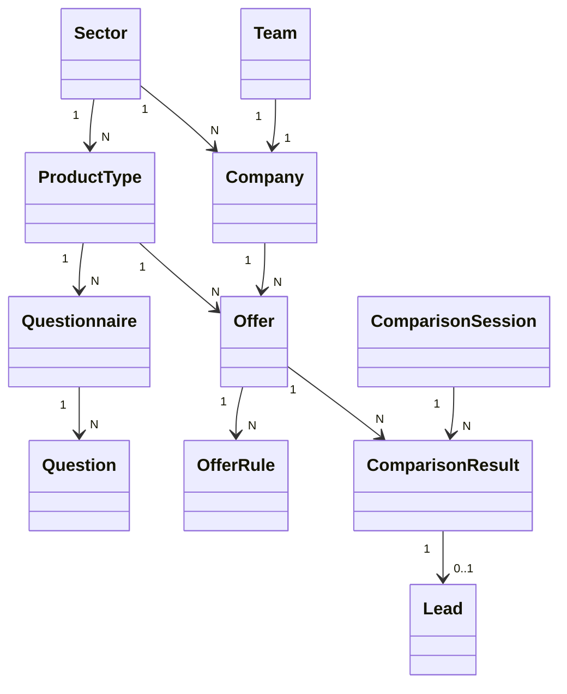

# Revue de modelisation et plan d'implementation accelere

Ce document sert de reference de travail pour lancer **KleverKat** dans la bonne direction, sans repartir dans une modelisation trop large ou trop abstraite.

Il complete et corrige les documents existants, en particulier `02-Modelling.md`, `03-Architecture.md`, `04-User-Roles.md`, `05-Use-Cases.md`, `08-Tech-Specs.md`, `09-Dynamic-Form-Implementation.md` et `10-Complete-LesFurets-Modeling.md`.

## 1. Etat reel du projet aujourd'hui

Le depot contient surtout un **starter Laravel 13 + Livewire 4 + Filament 5 + Fortify + Teams**.

Constats verifies dans le code :

- Le domaine metier n'est pas encore implemente.
- La base de donnees actuelle ne contient que `users`, `teams`, `team_members`, `team_invitations`, `passkeys`, `jobs`, `cache`, `sessions`.
- Les routes applicatives sont presque vides : `/`, `/{current_team}/dashboard`, et les routes de settings/auth.
- Le socle `teams` existe deja et peut accelerer l'espace partenaire.
- La documentation est beaucoup plus avancee que le code.

Conclusion : le vrai sujet n'est pas de "refactorer une app existante", mais de **stabiliser la bonne modelisation avant la premiere vraie implementation**.

## 2. Ce qui est juste dans la doc actuelle

Les documents existants ont deja capte plusieurs bons axes :

- La separation `secteur -> categorie -> questionnaire -> questions`.
- Le besoin de questionnaires dynamiques pilotes par la base.
- Le besoin d'un espace partenaire distinct de l'admin.
- Le besoin d'un moteur de scoring et d'un stockage des reponses utilisateur.
- L'usage de Filament pour l'admin et Livewire pour le parcours public.

Le probleme n'est donc pas l'intention. Le probleme est surtout la **precision du modele**.

## 3. Les problemes a corriger avant de coder

### 3.1. Le mot "produit" est utilise pour deux choses differentes

Dans ton besoin, il y a en realite deux niveaux :

1. Le **produit de comparaison** choisi par l'utilisateur.
   Exemple : assurance auto, assurance habitation, credit auto, carte bancaire.
2. L'**offre proposee par une entreprise**.
   Exemple : offre auto Allianz, formule habitation AXA, carte premium banque X.

Si on garde une seule table `products` liee directement a `companies`, on melange :

- le parcours de questionnaire,
- le catalogue public,
- et l'offre commerciale du partenaire.

Pour aller vite et rester propre, il faut separer :

- `product_types` : le produit de comparaison
- `offers` : l'offre commerciale du partenaire

### 3.2. Les coefficients actuels sont trop vagues

Le modele actuel de type :

- `scoring_coefficients(question_id, company_id, coefficient)`

ne suffit pas.

Pourquoi :

- un coefficient depend rarement seulement de la question,
- il depend souvent de la **reponse** ou d'une **condition**,
- et il doit souvent etre specifique a une **offre**, pas juste a toute l'entreprise.

Exemple :

- "si age < 25" => +20%
- "si usage = professionnel" => +15%
- "si logement = locataire" => score +8

Il faut donc un modele de regles par offre.

### 3.3. Le questionnaire doit appartenir au parcours, pas au partenaire

Le partenaire peut modifier :

- les informations de son offre,
- ses regles d'eligibilite,
- ses coefficients,
- ses garanties,
- son activation.

En revanche, le partenaire **ne doit pas** modifier :

- la structure globale du questionnaire,
- l'ordre des questions,
- les sections du parcours,
- la definition metier commune.

Sinon chaque partenaire casse le tunnel de comparaison.

### 3.4. Le role utilisateur de la doc ne colle pas au code

La doc parle de `users.role` et `users.company_id`.

Le code actuel, lui, est deja base sur :

- `teams`
- `team_members`
- `current_team_id`

Donc il y a un ecart majeur entre la doc et le starter reel.

Pour aller vite, il vaut mieux :

- garder `Team` comme conteneur d'organisation partenaire,
- lier `Company` a `Team`,
- utiliser les memberships existants pour les utilisateurs partenaires,
- ajouter seulement un marqueur systeme pour l'admin global.

### 3.5. Une comparaison n'est pas forcement un lead

La doc actuelle cree parfois le lead trop tot.

Il faut separer :

- la **simulation/comparaison**
- du **lead commercial**

Sinon on pollue tres vite les partenaires avec des faux leads.

Le bon flux est :

1. l'utilisateur compare,
2. on calcule et affiche les resultats,
3. un lead n'est cree qu'au moment d'une action utile :
   - demande de devis,
   - demande de rappel,
   - clic vers le partenaire,
   - transmission explicite.

## 4. Modelisation cible recommandee

## 4.1. Vue d'ensemble

## 4.2. Tables coeur de metier

### `sectors`

But :

- definir les grands univers : assurance, banque, energie, telecom.

Colonnes clefs :

- `id`
- `name`
- `slug`
- `description`
- `is_active`

### `product_types`

But :

- representer le "type de produit a comparer" visible par le client.

Exemples :

- assurance-auto
- assurance-habitation
- mutuelle-sante
- pret-immobilier

Colonnes clefs :

- `id`
- `sector_id`
- `name`
- `slug`
- `description`
- `icon`
- `sort_order`
- `is_active`

Remarque :

- Cette table remplace le flou actuel entre `ProductCategory` et `Product`.

### `companies`

But :

- representer les entreprises partenaires.

Colonnes clefs :

- `id`
- `sector_id`
- `team_id`
- `name`
- `slug`
- `logo_path`
- `description`
- `website_url`
- `support_email`
- `support_phone`
- `is_active`

Decision MVP :

- une entreprise appartient a un seul secteur pour aller vite.
- si un jour une entreprise doit couvrir plusieurs secteurs, on passera a un pivot `company_sector`.

### `offers`

But :

- representer les offres concretes proposees par les partenaires sur un `product_type`.

Exemples :

- Allianz Auto Confort
- AXA Habitation Essentielle
- Banque X Carte Gold

Colonnes clefs :

- `id`
- `company_id`
- `product_type_id`
- `name`
- `slug`
- `short_description`
- `long_description`
- `base_price`
- `price_note`
- `is_active`
- `is_featured`
- `sort_order`

Important :

- c'est **l'offre** que le partenaire peut modifier,
- pas le `product_type`.

### `offer_features`

But :

- stocker les garanties, avantages et caracteristiques affichables.

Colonnes clefs :

- `id`
- `offer_id`
- `label`
- `value`
- `is_highlight`
- `sort_order`

### `questionnaires`

But :

- definir un parcours de questions pour un `product_type`.

Colonnes clefs :

- `id`
- `product_type_id`
- `name`
- `version`
- `is_active`

Regle :

- un seul questionnaire actif par `product_type` en MVP,
- versionning conserve pour rejouer les anciennes simulations.

### `questions`

But :

- stocker les questions d'un questionnaire dynamique.

Colonnes clefs :

- `id`
- `questionnaire_id`
- `step_key`
- `field_key`
- `label`
- `input_type`
- `options_json`
- `validation_rules_json`
- `display_conditions_json`
- `sort_order`
- `is_required`
- `is_active`

Choix MVP :

- `options_json` reste acceptable pour aller vite,
- `display_conditions_json` reste acceptable tant qu'on garde une structure simple,
- si la logique grossit, on externalisera plus tard vers des tables de regles.

### `offer_rules`

But :

- centraliser les regles propres a chaque offre partenaire.

Cette table doit couvrir deux usages :

- l'eligibilite
- le scoring/pricing

Colonnes clefs :

- `id`
- `offer_id`
- `question_id`
- `rule_type`
- `operator`
- `expected_value`
- `weight`
- `score_delta`
- `price_delta`
- `price_multiplier`
- `priority`
- `is_active`

Exemples :

- `rule_type = eligibility`, `operator = lt`, `expected_value = 21`
- `rule_type = scoring`, `operator = eq`, `expected_value = "professionnel"`, `score_delta = 15`
- `rule_type = pricing`, `operator = eq`, `expected_value = "paris"`, `price_multiplier = 1.15`

Pourquoi une table unique :

- plus rapide a implementer qu'un moteur ultra normalise,
- suffisante pour le MVP,
- extensible ensuite vers plusieurs tables specialisees si necessaire.

### `comparison_sessions`

But :

- stocker chaque simulation utilisateur.

Colonnes clefs :

- `id` UUID
- `product_type_id`
- `questionnaire_id`
- `user_id` nullable
- `answers_json`
- `started_at`
- `completed_at`
- `ip_address`
- `user_agent`

### `comparison_results`

But :

- conserver les resultats calcules pour une simulation donnee.

Colonnes clefs :

- `id`
- `comparison_session_id`
- `offer_id`
- `company_id`
- `is_eligible`
- `score`
- `calculated_price`
- `explanation_json`
- `rank_position`

Cette table est importante car elle :

- evite de recalculer a chaque consultation,
- permet l'audit,
- facilite l'historique,
- sert de base propre pour la creation d'un lead.

### `leads`

But :

- representer une action commerciale utile issue d'un resultat.

Colonnes clefs :

- `id`
- `comparison_result_id`
- `company_id`
- `offer_id`
- `contact_first_name`
- `contact_last_name`
- `contact_email`
- `contact_phone`
- `status`
- `sent_at`

Regle :

- pas de lead automatique a chaque simulation.

## 5. Roles et ownership recommandes

## 5.1. Admin global

L'admin global gere :

- secteurs
- product types
- entreprises
- questionnaire
- questions
- activation globale des offres
- moderation

Implementation conseillee :

- utiliser Filament pour cet espace,
- ajouter un marqueur admin global sur `users`.

Le plus simple :

- `users.is_admin`

## 5.2. Partenaire

Le partenaire gere uniquement :

- son entreprise
- ses offres
- ses garanties
- ses regles d'eligibilite
- ses regles de scoring/prix
- ses leads

Implementation conseillee :

- reutiliser `Team` comme organisation partenaire,
- `companies.team_id` unique,
- les utilisateurs partenaires sont des membres de la team,
- `current_team_id` sert deja de contexte actif.

## 5.3. Pourquoi il faut garder `teams`

Le starter contient deja :

- la gestion des membres,
- les invitations,
- le changement de contexte d'equipe,
- des tests deja en place,
- des middlewares et conventions autour de `current_team`.

Le supprimer maintenant ralentirait le projet.

## 6. Architecture fonctionnelle recommandee

## 6.1. Cote public

Flux cible :

1. L'utilisateur ouvre la home.
2. Il choisit un secteur.
3. Il choisit un `product_type`.
4. Le questionnaire actif de ce `product_type` se charge.
5. Il repond.
6. Le moteur :
   - filtre les offres ineligibles,
   - calcule score + prix,
   - classe les offres.
7. On affiche les resultats :
   - offres
   - entreprise
   - points forts
   - prix estime
8. Si l'utilisateur clique sur une action commerciale, on cree le lead.

## 6.2. Cote partenaire

Flux cible :

1. Le partenaire se connecte.
2. Il arrive dans le contexte de sa `team`.
3. Il voit :
   - dashboard
   - mes offres
   - regles de calcul
   - leads
   - profil entreprise
4. Il ne peut modifier que les donnees de sa `company`.

## 6.3. Cote admin

Flux cible :

1. Creation des secteurs
2. Creation des product types
3. Creation des entreprises
4. Creation des teams partenaires
5. Creation des offres partenaires
6. Creation du questionnaire et des questions
7. Activation du tunnel public

## 7. Ce qu'il faut implementer pour aller vite

## 7.1. Ce qu'il faut faire maintenant

### Phase 1. Stabiliser le socle de domaine

Creer :

- `users.is_admin`
- `sectors`
- `product_types`
- `companies`
- `offers`
- `offer_features`

Puis :

- lier `companies.team_id` au systeme `teams` existant,
- decider qu'une entreprise = une team partenaire en MVP.

### Phase 2. Construire le moteur de questionnaire

Creer :

- `questionnaires`
- `questions`

Puis :

- un resource Filament pour l'admin,
- un questionnaire actif par `product_type`,
- un rendu Livewire du wizard public.

### Phase 3. Construire le moteur de regles

Creer :

- `offer_rules`

Puis :

- un `ComparisonEngine` ou `ComparisonService`,
- une evaluation en trois etapes :
  - eligibilite
  - scoring
  - pricing

### Phase 4. Sauvegarder les simulations

Creer :

- `comparison_sessions`
- `comparison_results`

Puis :

- affichage des resultats,
- classement,
- historique simple.

### Phase 5. Brancher la conversion

Creer :

- `leads`

Puis :

- CTA "demander un devis",
- CTA "etre rappelle",
- CTA "voir l'offre",
- transmission partenaire plus tard.

## 7.2. Ce qu'il ne faut pas faire tout de suite

Pour tenir le delai, il faut repousser :

- le multi-secteur par entreprise,
- les alertes prix,
- la facturation CPL/CPA,
- les API temps reel partenaires,
- les parcours conversationnels IA,
- les dashboards complexes,
- une architecture Go/Vue separee.

Le document `12-golang-architecture.md` peut rester une piste future, mais **ce n'est pas le chemin le plus rapide dans ce projet**.

## 8. Ordre d'implementation recommande dans ce depot

Ordre concret des fichiers/metiers a creer :

1. Migrations
   - `create_sectors_table`
   - `create_product_types_table`
   - `create_companies_table`
   - `create_offers_table`
   - `create_offer_features_table`
   - `create_questionnaires_table`
   - `create_questions_table`
   - `create_offer_rules_table`
   - `create_comparison_sessions_table`
   - `create_comparison_results_table`
   - `create_leads_table`
2. Models
   - `Sector`
   - `ProductType`
   - `Company`
   - `Offer`
   - `OfferFeature`
   - `Questionnaire`
   - `Question`
   - `OfferRule`
   - `ComparisonSession`
   - `ComparisonResult`
   - `Lead`
3. Admin Filament
   - `SectorResource`
   - `ProductTypeResource`
   - `CompanyResource`
   - `OfferResource`
   - `QuestionnaireResource`
4. Services
   - `ComparisonService`
   - `EligibilityEvaluator`
   - `ScoringEvaluator`
   - `PricingEvaluator`
5. Public Livewire
   - page liste secteurs
   - page liste product types
   - page compare wizard
   - page results
6. Partner space
   - dashboard
   - offers
   - rules
   - leads
   - company profile

## 9. Version MVP la plus realiste

Si on veut une livraison rapide, le MVP doit etre :

- 2 secteurs maximum au debut
- 1 questionnaire actif par `product_type`
- options de questions en JSON
- regles dans une seule table `offer_rules`
- pas d'appel API partenaire
- pas de billing
- pas de back-office complexe de moderation

Exemple de perimetre MVP propre :

- `Assurance`
- `Banque`
- `Assurance auto`
- `Mutuelle sante`
- `Compte bancaire`

Avec :

- 3 a 5 entreprises
- 2 a 4 offres par entreprise
- 1 tunnel de comparaison par `product_type`

## 10. Decision recommande

La meilleure decision pour ce projet est la suivante :

- garder **Laravel + Filament + Livewire**,
- reutiliser le **systeme Teams** pour l'espace partenaire,
- separer clairement **product type** et **offer**,
- stocker les regles de partenaire dans `offer_rules`,
- distinguer **comparison session** et **lead**,
- lancer un MVP simple avant toute sophistication.

Si on suit cette base, le projet devient implementable rapidement sans casser la logique metier plus tard.
